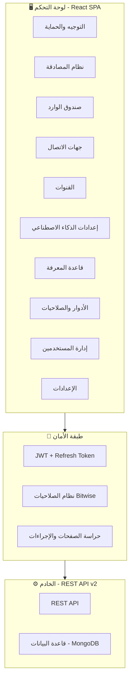
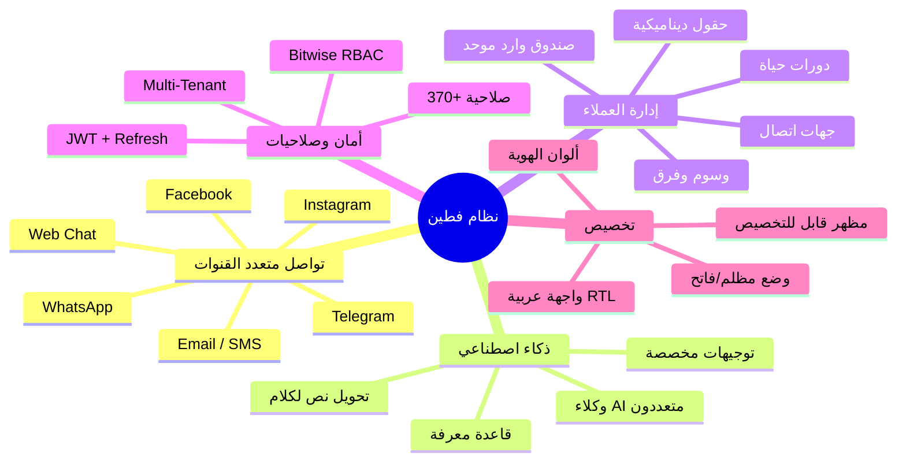

<div dir="rtl">

# 📋 تقرير نظام فطين — لوحة التحكم الإدارية
### نظام إدارة التواصل الذكي متعدد القنوات

---

## 🏢 نظرة عامة

**فطين** هو نظام متكامل لإدارة التواصل مع العملاء يعمل كمنصة **متعددة المستأجرين (Multi-Tenant)**، مبني بتقنيات حديثة وموجّه بالكامل لدعم **اللغة العربية** مع واجهة RTL احترافية. يوفر النظام حلاً شاملاً لإدارة المحادثات، جهات الاتصال، فرق العمل، والذكاء الاصطناعي من لوحة تحكم واحدة.

---

## ⚡ المواصفات التقنية

| المكون | التقنية | الإصدار |
|--------|---------|---------|
| **إطار العمل** | React | 19.2 |
| **لغة البرمجة** | TypeScript | 5.9 |
| **أداة البناء** | Vite | 7.3 |
| **التنسيق** | TailwindCSS | 4.1 |
| **إدارة الحالة** | Zustand | 5.0 |
| **جلب البيانات** | TanStack React Query | 5.90 |
| **الجداول** | TanStack React Table | 8.21 |
| **النماذج** | React Hook Form + Zod | 7.71 / 4.3 |
| **الرسوم البيانية** | Recharts | 3.7 |
| **HTTP Client** | Axios | 1.13 |
| **التوجيه** | React Router DOM | 7.13 |
| **الأيقونات** | Lucide React | 0.564 |
| **الإشعارات** | Sonner | 2.0 |

---

## 🏗️ هيكلية النظام (Architecture)



### نمط التصميم

يتبع النظام **هيكلية قائمة على الميزات (Feature-Based Architecture)** حيث يتكون من **12 وحدة مستقلة**، كل وحدة تحتوي على:

| الطبقة | الوصف |
|--------|-------|
| `pages/` | الصفحات الرئيسية |
| `components/` | المكونات المرئية |
| `hooks/` | الخطافات المخصصة (React Hooks) |
| `services/` | خدمات الاتصال بالـ API |
| `types/` | أنواع TypeScript |
| `store/` | إدارة الحالة المحلية |

---

## 🔐 1. نظام المصادقة والأمان

### تسجيل الدخول المتعدد (Multi-Tenant Login)

- ✅ تسجيل دخول ذكي: إذا كان البريد الإلكتروني مسجلاً في **شركة واحدة** → دخول مباشر
- ✅ إذا كان مسجلاً في **عدة شركات** → عرض قائمة اختيار الشركة مع عرض اسم الشركة ودور المستخدم
- ✅ تسجيل حساب جديد مع التحقق من البريد الإلكتروني
- ✅ صفحة **Onboarding** لإكمال إعداد الحساب
- ✅ استعادة كلمة المرور المنسية

### التجديد التلقائي للرموز (Auto Token Refresh)

- عند انتهاء صلاحية `access_token`، يقوم النظام تلقائياً بتجديده عبر `refresh_token`
- **قائمة انتظار ذكية**: جميع الطلبات المعلقة أثناء التجديد تُعاد تلقائياً بعد الحصول على الرمز الجديد
- تسجيل خروج تلقائي عند فشل التجديد

### إدراج معرّف المستأجر (X-Tenant-ID)

- كل طلب API يتضمن تلقائياً هوية المستأجر `X-Tenant-ID` لضمان عزل البيانات بين الشركات

---

## 🛡️ 2. نظام الصلاحيات (RBAC - Bitwise Permissions)

نظام صلاحيات متقدم يعتمد على **العمليات الثنائية (Bitwise Operations)** لأداء عالٍ وكفاءة في التخزين.

### المستوى الأول — صلاحية دخول الصفحة

يتم التحقق بعملية `AND` ثنائية: `(totalPages & PAGE_BIT) !== 0`

| الصفحة | القيمة |
|--------|--------|
| صندوق الوارد | `16,777,216` |
| جهات الاتصال | `2` |
| إدارة المستخدمين | `32,768` |
| الأدوار | `1,024` |
| القنوات | `131,072` |
| إعدادات الذكاء الاصطناعي | `1,048,576` |
| قاعدة المعرفة | `16` |
| الأقسام | `524,288` |
| الوسوم | `4,096` |
| الفرق | `8,192` |
| دورات الحياة | `32` |
| المقتطفات | `2,048` |
| الوكلاء | `8,388,608` |

### المستوى الثاني — صلاحية الإجراءات داخل الصفحة

لكل صفحة إجراءات محددة (عرض، إنشاء، تعديل، حذف) يتم التحقق منها بنفس الآلية.

> يتضمن النظام **أكثر من 370 إجراء مختلف** موزعة على جميع القنوات والوحدات.

### الحماية في الواجهة

- **`PermissionGuard`** — يحمي الصفحات الكاملة (يمنع الوصول للصفحات غير المصرح بها)
- **`ActionGuard`** — يخفي أو يعطّل الأزرار والإجراءات حسب صلاحيات المستخدم
- **`AuthGuard`** — يعيد التوجيه لصفحة تسجيل الدخول إذا لم يكن المستخدم مسجلاً

---

## 📨 3. صندوق الوارد (Inbox) — المحرك الأساسي

صندوق وارد موحّد يجمع جميع المحادثات من مختلف القنوات في مكان واحد.

### هيكل الواجهة (3 أعمدة)

```
┌─────────────┬──────────────────┬────────────────┐
│  الشريط     │  قائمة           │  تفاصيل        │
│  الجانبي    │  المحادثات       │  المحادثة       │
│ (التصنيف)   │  (مع الفلاتر)    │  + تفاصيل      │
│             │                  │  الاتصال        │
└─────────────┴──────────────────┴────────────────┘
```

### الميزات الرئيسية

| الميزة | الوصف |
|--------|-------|
| **المحادثات الموحّدة** | عرض جميع المحادثات من WhatsApp, Facebook, Instagram, Telegram, Email, SMS, Web Chat |
| **التصفية المتقدمة** | بحسب الحالة (مفتوح/مغلق/معلق)، المنصة، المسؤول، دورة الحياة، الفريق، الوسوم |
| **البحث** | بحث فوري في المحادثات |
| **إحصائيات جانبية** | إجمالي، المعينة لي، غير معينة، حسب دورة الحياة، حسب الفريق |
| **المفضلة والكتم** | إمكانية تمييز المحادثات كمفضلة أو كتم الإشعارات |
| **عدد الرسائل غير المقروءة** | عداد لكل محادثة |

### محرّر الرسائل (Message Composer)

| الميزة | الوصف |
|--------|-------|
| **إرسال نصوص** | إرسال رسائل نصية بضغطة Enter أو زر الإرسال |
| **رفع وسائط متعددة** | صور، فيديو، صوت، مستندات — مع رفع تلقائي عبر `/media/upload` |
| **المقتطفات (Snippets)** | اكتب `/` لعرض قوالب الرسائل الجاهزة مع بحث فوري |
| **المتغيرات (Variables)** | اكتب `$` لإدراج بيانات العميل ديناميكياً (الاسم، الهاتف، البريد...) |
| **الإيموجي** | لوحة إيموجي سريعة |
| **التعليقات الداخلية** | وضع التعليق مع دعم **@mention** لأعضاء الفريق |
| **الرد على رسالة** | إمكانية الرد على رسالة محددة |
| **AI Assist** | زر المساعدة بالذكاء الاصطناعي |
| **Summarize** | زر تلخيص المحادثة |

### إجراءات العميل (Customer Actions)

| الإجراء | الوصف |
|---------|-------|
| **تعيين مسؤول** | تعيين أو تغيير المسؤول عن المحادثة |
| **تعيين فرق** | إضافة أو إزالة فرق عمل |
| **تغيير دورة الحياة** | تحديث مرحلة العميل (عميل جديد، مهتم، متابعة...) |
| **إدارة الوسوم** | إضافة/إزالة الوسوم مع بحث وتصفية |
| **فتح/إغلاق المحادثة** | مع تحديد السبب والفئة |
| **تفعيل/تعطيل AI** | التحكم في الذكاء الاصطناعي لكل عميل |
| **تغيير حالة الجلسة** | مفتوحة/مغلقة/معلقة |
| **تعديل الحقول المخصصة** | تعديل فوري للحقول الديناميكية |

### تفاصيل المحادثة (تبويبات)

| التبويب | المحتوى |
|---------|---------|
| **جهة الاتصال** | الاسم، الهاتف، البريد، المنصة، الحقول المخصصة مع تعديل فوري |
| **المحادثة** | الحالة، المسؤول، الفريق، دورة الحياة، تاريخ الإنشاء |
| **الوسوم** | إدارة الوسوم مع لوحة بحث وإضافة تفاعلية |

### رسائل النظام (System Messages)

- عرض أحداث النظام (تعيين مسؤول، تغيير المرحلة، إغلاق/فتح المحادثة) بشكل مرئي واحترافي
- دعم العرض التفصيلي عند النقر على الرسالة

### عرض الوسائط (Media Lightbox)

- عارض وسائط متقدم بملء الشاشة للصور والفيديو
- تضبيب الخلفية، زر إغلاق، تحميل، عرض التوضيح
- دعم الإغلاق بلوحة المفاتيح

---

## 👥 4. إدارة جهات الاتصال (Contacts)

### هيكل الواجهة (3 أعمدة)

```
┌──────────────┬───────────────────┬────────────────┐
│  الشريط      │  جدول جهات        │  تفاصيل        │
│  الجانبي     │  الاتصال          │  جهة الاتصال   │
│ (التنقل)     │  (بحث + فلاتر)    │                │
└──────────────┴───────────────────┴────────────────┘
```

### الميزات

| الميزة | الوصف |
|--------|-------|
| **الشريط الجانبي** | تصنيف حسب دورة الحياة والفرق مع عدد جهات الاتصال لكل فئة |
| **جدول تفاعلي** | أعمدة ثابتة + أعمدة ديناميكية من الحقول المخصصة |
| **البحث والتصفية** | بحث فوري مع فلاتر متقدمة |
| **التحديد المتعدد** | اختيار عدة جهات اتصال للعمليات الجماعية |
| **التصفح بالصفحات** | مع خيارات حجم الصفحة (10, 25, 50, 100) |
| **التفاصيل** | لوحة جانبية تعرض كامل بيانات جهة الاتصال |

---

## 📡 5. إدارة القنوات (Channels)

### القنوات المدعومة

| القناة | الوصف |
|--------|-------|
| 💬 **WhatsApp** | WhatsApp Business API |
| 📘 **Facebook** | Facebook Messenger |
| 📸 **Instagram** | Instagram Direct Messages |
| ✈️ **Telegram** | Telegram Bot API |
| 📧 **Email** | البريد الإلكتروني |
| 💬 **SMS** | الرسائل القصيرة |
| 🌐 **Web Chat** | دردشة الموقع الإلكتروني |

### ميزات إدارة القنوات

- ✅ عرض جميع القنوات النشطة على شكل بطاقات احترافية
- ✅ **تفعيل/تعطيل** القنوات بزر Toggle
- ✅ **إضافة قنوات جديدة** (Create Channel)
- ✅ **حذف القنوات** مع نافذة تأكيد
- ✅ عرض حالة الاتصال (متصل/غير متصل)
- ✅ نسخ معرّف القناة
- ✅ **بحث وتصفية** القنوات
- ✅ مؤشرات بصرية لحالة البوت والاتصال

---

## 🤖 6. إعدادات الذكاء الاصطناعي (AI Settings)

### إدارة الوكلاء (AI Agents)

نظام متعدد الوكلاء يسمح بإنشاء وتخصيص عدة وكلاء ذكاء اصطناعي:

| الميزة | الوصف |
|--------|-------|
| **إنشاء وكيل** | إنشاء وكلاء AI مع تحديد الأقسام والفئات المرتبطة |
| **تعديل الوكيل** | تعديل اسم الوكيل ووصفه وإعداداته |
| **حذف الوكيل** | مع تأكيد الحذف |
| **البحث** | بحث سريع في قائمة الوكلاء |

### تبويبات الإعدادات

| التبويب | الوصف |
|---------|-------|
| 🧠 **الذكاء الاصطناعي** | إعدادات نموذج AI، مزود الخدمة، الميزات |
| 📝 **التوجيهات (Prompts)** | تخصيص التوجيهات والتعليمات للوكيل |
| ⚡ **الميزات (Features)** | تفعيل/تعطيل ميزات محددة |
| 🔊 **تحويل النص لكلام (TTS)** | إعدادات تحويل النص إلى كلام مع اختيار مزود الخدمة |

---

## 📚 7. قاعدة المعرفة (Knowledge Base)

مركز موحّد لإدارة المعرفة وتدريب الذكاء الاصطناعي:

| التبويب | الوصف |
|---------|-------|
| 📊 **تحليلات المستندات** | إحصائيات وتقارير عن المستندات المرفوعة |
| 📁 **إدارة البيانات** | رفع وإدارة الملفات والمستندات |
| 🏢 **الأقسام** | إنشاء وإدارة أقسام المعرفة |
| 📂 **الفئات** | تصنيف المستندات حسب الفئات |
| ⏳ **الطلبات المعلقة** | مراجعة واعتماد أو رفض طلبات التدريب |
| 📜 **سجل العمليات** | تتبع جميع العمليات المنفذة على قاعدة المعرفة |

---

## 👤 8. إدارة المستخدمين (Users Management)

| الميزة | الوصف |
|--------|-------|
| **جدول المستخدمين** | عرض جميع المستخدمين مع التفاصيل |
| **إنشاء مستخدم** | إضافة مستخدمين جدد مع تحديد الدور |
| **تعديل المستخدم** | تحديث بيانات ودور المستخدم |
| **حذف المستخدم** | مع تأكيد الحذف |
| **تعيين الأدوار** | ربط المستخدمين بالأدوار والصلاحيات |
| **البحث** | بحث فوري في قائمة المستخدمين |
| **تجديد البيانات** | زر تحديث فوري |

---

## 🛡️ 9. الأدوار والصلاحيات (Roles & Permissions)

### هيكل الواجهة (عمودان)

```
┌──────────────────┬──────────────────────┐
│  قائمة الأدوار   │  تفاصيل الدور        │
│  (مع العدد)      │  + شجرة الصلاحيات    │
└──────────────────┴──────────────────────┘
```

### الميزات

- ✅ عرض قائمة الأدوار مع إمكانية الاختيار
- ✅ عرض تفاصيل الدور مع شجرة الصلاحيات الكاملة
- ✅ إنشاء أدوار جديدة
- ✅ تعديل صلاحيات الأدوار (إضافة/إزالة)
- ✅ حذف الأدوار
- ✅ تعيين/إزالة المستخدمين من الأدوار

---

## ⚙️ 10. إعدادات المؤسسة (Organization Settings)

لوحة إعدادات شاملة مع **9 تبويبات**:

| التبويب | الوصف |
|---------|-------|
| ⚙️ **الإعدادات العامة** | بيانات المؤسسة الأساسية |
| 👥 **الفرق (Teams)** | إنشاء وإدارة فرق العمل مع الأعضاء والألوان |
| 🏷️ **الوسوم (Tags)** | إنشاء وإدارة الوسوم مع الألوان للتصنيف |
| 📝 **المقتطفات (Snippets)** | قوالب رسائل جاهزة بأنواع متعددة (نص، صورة، فيديو، مستند) مع رفع الوسائط |
| 🔄 **دورات الحياة (Lifecycles)** | إنشاء وترتيب مراحل العميل مع الأيقونات |
| 📋 **حقول جهات الاتصال** | إنشاء وإدارة الحقول الديناميكية (نص، رقم، بريد، تاريخ...) |
| 🤖 **الذكاء الاصطناعي** | إعدادات AI المتقدمة |
| 🎨 **تخصيص المظهر** | تغيير ألوان الواجهة لتتناسب مع هوية المؤسسة |
| 💳 **الاشتراك والدفع** | إدارة الخطة الحالية وعرض الفواتير |

### نظام تخصيص المظهر (Theme Customization)

- ✅ **الوضع المظلم/الفاتح** (Dark/Light Mode) مع تبديل فوري
- ✅ تخصيص **10 رموز لونية** لكل وضع:
  - لون التمييز الرئيسي (Accent)
  - ألوان النجاح والتحذير والخطأ والمعلومات
  - ألوان النصوص والخلفيات
- ✅ حفظ التفضيلات محلياً وتطبيقها فوراً

---

## 📊 11. لوحة التحكم (Dashboard)

الصفحة الرئيسية بعد تسجيل الدخول تعرض:
- بطاقات إحصائية سريعة (المستخدمين، المستندات، التحليلات، الإعدادات)
- مساحة مخصصة للرسوم البيانية والتقارير *(قيد التطوير)*

---

## 🔄 12. معالجة الأخطاء والتجربة

| الميزة | الوصف |
|--------|-------|
| **إشعارات Toast** | إشعارات نجاح/خطأ فورية عبر Sonner |
| **حالات التحميل** | هياكل عظمية (Skeleton) ومؤشرات تحميل احترافية |
| **حالات الخطأ** | عرض رسائل خطأ واضحة مع زر إعادة المحاولة |
| **حالات فارغة** | عرض رسائل توجيهية عند عدم وجود بيانات |
| **شريط التجديد** | مؤشر بصري أثناء تحديث البيانات في الخلفية |
| **التحقق من النماذج** | تحقق فوري مع Zod و React Hook Form |
| **التوافق مع الأحجام** | تصميم متجاوب يعمل على جميع أحجام الشاشات |

---

## 🌟 المميزات الرئيسية — ملخص تنفيذي



---

## 🔑 النقاط الرئيسية للعرض

1. **نظام متعدد المستأجرين** — شركات متعددة على منصة واحدة مع عزل كامل للبيانات
2. **7+ قنوات اتصال** — WhatsApp, Facebook, Instagram, Telegram, Email, SMS, Web Chat
3. **ذكاء اصطناعي متكامل** — وكلاء AI متعددون مع قاعدة معرفة وتحويل نص لكلام
4. **نظام صلاحيات متقدم** — 370+ صلاحية مع تحكم دقيق على مستوى الصفحات والإجراءات
5. **واجهة عربية أصلية** — تصميم RTL احترافي مع دعم كامل للعربية
6. **محرّر رسائل متقدم** — مقتطفات، متغيرات، إيموجي، تعليقات، @mentions، رفع وسائط
7. **تخصيص المظهر** — ألوان الهوية المؤسسية مع وضع مظلم/فاتح
8. **حقول ديناميكية** — إنشاء حقول مخصصة لجهات الاتصال بدون تعديل الكود
9. **تقنيات حديثة** — React 19, TypeScript 5.9, Vite 7 — أحدث الإصدارات
10. **أداء عالٍ** — تخزين مؤقت ذكي مع TanStack Query وإدارة حالة فعّالة مع Zustand

</div>
